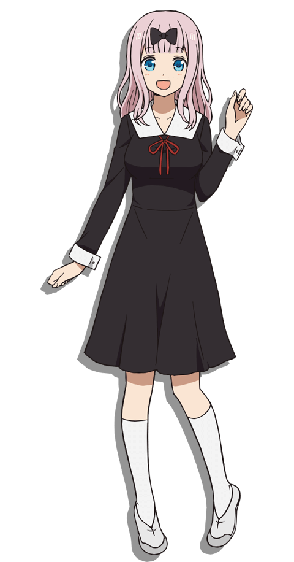

# AniPersonaCaps

Welcome to AniPersonaCaps! This is an immersive collection of anime characters, each paired with detailed, human-crafted descriptions of their looks and personalities.

This dataset brings together 45k+ unique characters from 1k+ beloved anime titles, capturing the essence of each character straight from the nijigen realm.

Our data is lovingly sourced from Fandom Wiki, a true treasure trove thanks to the dedication of anime fans worldwide.

We've made a first attempt to filter out duplicates (e.g., same appearance description) and flagged images (e.g., images with "No Image Found" sign), but there might still be other flaws.

**Note:**

While usable, the current version is still under development. Further updates and additional data are on the way!

## Updates

- [2024.11.06] Initial Release of AniPersonaCaps [Huggingface](https://huggingface.co/datasets/mrzjy/AniPersonaCaps)

## Statistics

| Wiki Creation Year                                     | Anime Characters                                    |
|--------------------------------------------------------|-----------------------------------------------------|
|  |  |

## Showcase

- Table-View

| Image                                                                                     | Character | Appearance | Personality |
|:-------------------------------------------------------------------------------------------:|:-----------------:|:-----------------:|:----------:|
| | Frieren | Frieren is a petite, female elf with green eyes, thick eyebrows, and long, white hair parted in the middle and tied into two high pigtails. Like all elves, she has large, pointed ears. She wears a striped black and white shirt, along with a white jacket tucked into a skirt with a black belt. The sleeves of her jacket end with large, gold cuffs. Both her jacket and skirt have gold trims along the edges... | Frieren has an easy-going personality, however, her aloof attitude makes her a mystery to her peers, as humans and elves tend to see things differently. [7] As an elf who has lived for at least a millennium, she has a poor sense of time that manifests in a bad habit of being unable to get up in the morning, along with a deeper inability to comprehend how time passes for humans... |
| | Chika Fujiwara | Chika is a cute fair-skinned young girl with shoulder-length silver hair (light pink in the anime) that has a black bow in the middle of her square bangs, blue eyes and she is just a few centimeters shorter than Kaguya Shinomiya . And as noted by Kaguya, Chika has a rather large chest size.\nShe is usually dressed in a Shuchi'in Academy high school uniform and occasionally she ties her hair in a slightly high ponytail. | Chika is a bubbly, eccentric girl who almost always has a smile on her face. Always looking to have fun with her fellow student council members, she is often the one to come up with strange activities and ideas that entertain herself and the others. She is mostly oblivious to the atmosphere of the room...|

- JSON-View (metadata.jsonl)

```json
{
  "file_name": "images/images_23/be3ff5f2-a584-49d6-9d6b-17a951ea825a.png",
  "title": "Frieren: Beyond Journey's End",
  "character": "Frieren",
  "appearance": "Frieren is a petite, female elf with green eyes, thick eyebrows, and long, white hair parted in the middle and tied into two high pigtails. Like all elves, she has large, pointed ears. She wears a striped black and white shirt, along with a white jacket tucked into a skirt with a black belt. The sleeves of her jacket end with large, gold cuffs. Both her jacket and skirt have gold trims along the edges. Over her jacket, she wears a short cape that matches the white and gold theme of her jacket and skirt, and the cape includes decorative, gold accents with red jewels on each shoulder and a high collar that is fastened with a red jewel. She also wears black tights, brown boots, and a pair of gold earrings with red, teardrop-shaped jewels hanging from each earring.\nDuring her travels, Frieren carries a brown briefcase holding various magic items and personal belongings. When casting spells as a mage , she utilizes a red staff with a gold, crescent-shaped tip that holds a red jewel in its center. Her staff has gold accents and a red ribbon tied at the tip.\nIn the colder seasons, Frieren wears a high-collared and long-sleeved white dress with gold accents and buttons down the chest instead of her usual jacket, skirt, and cape. Additionally, she layers a beige coat with a flap collar and buttons over her dress and dons a blue scarf tied on the side.\nWhen she was training under Flamme a thousand years prior, Frieren let her hair down to her waist and wore simple, white dresses and brown sandals. During Frieren's solitary lifestyle after Flamme's death, she tied her hair into her typical pigtails and wore a white dress with a black belt and beige cape.",
  "personality": "Frieren has an easy-going personality, however, her aloof attitude makes her a mystery to her peers, as humans and elves tend to see things differently. [7] As an elf who has lived for at least a millennium, she has a poor sense of time that manifests in a bad habit of being unable to get up in the morning, along with a deeper inability to comprehend how time passes for humans. This is, in part, a reason for Frieren's aloof attitude, since she sees large lengths of time as too brief for her to form meaningful connections. For instance, she thought of a ten-year journey with her comrades as short and believed she knew nothing about Himmel the Hero , even up until his passing. However, following Himmel's funeral, she made the decision to get to know humans better.\nAlthough she is generally stoic, carefree, and often lacks tact, Frieren also has things she is emotionally sensitive to. She was embarrassed when others discovered her mana detection is interrupted for a fraction of a second when a spell is cast, a common error for apprentice mages that she has yet to overcome. She is sensitive to people calling her old and holds a grudge against Stark for doing so multiple times. When she is upset, she is capable of throwing a tantrum that can result in her crying for upwards of three days, scaring the other members of the Hero Party . In addition, Frieren can experience an extreme temper around once every decade, to the point where she could kill someone when provoked. [8] This rage lasts only up to 10 minutes. [9] It is also implied that she is somewhat insecure about her body, as she occasionally shows hints of jealousy over Fern's figure.",
  "url": "https://frieren.fandom.com/wiki/Frieren"
}
```

## Intended uses

- Image Caption (Appearance Description & Personality Inference)
- Image-Text Matching
- Anime Character Study

## Known Issue

Currently, there's a known issue with the web-scraping logic that causes some deeply nested character category pages to be unintentionally excluded (e.g., pages on the One Piece Fandom Wiki).

We plan to address this in the next update.

## Limitations

### Limited Content Scope

Our approach to gathering anime titles has limitations, so some titles may have been missed.

For text, we only included characters whose Fandom wiki pages contain a non-empty "Appearance" section. As a result, many characters might not appear in this dataset.

As for image, we only grabbed the first image from the sidebar (infobox) of each Fandom wiki page; additional images were sadly not included.

But don't worry, with the provided Fandom URLs, you can always dive in and explore all the extra images at your leisure!

### Potential Image-Text Mismatch

- **Too Much Text**

At times, the appearance descriptions may be lengthy, spanning multiple paragraphs and introducing several appearances for a single character. However, this can result in mismatches with the associated image, as only the first figure from the Wiki page is captured.

Please take care when using this data for image captioning tasks to avoid potential hallucination issues. To remedy this, we recommend performing some processing on the data. Using a powerful vision-language model to filter and extract only the most relevant appearance description can help create a more precise match between each image and its caption.

- **Incomplete Image**

Sometimes, the character figure in the image is only partially visible (e.g., a headshot or half-body, image without colors (black and white)), which may not fully align with the details in the "appearance" field that describe a full-body view. This can introduce another type of mismatch.

To address this, consider using a vision (-language) model to identify and categorize the character’s visible features (e.g., face-only, half-body, or full-body) and filter or modify descriptions accordingly.

- **Text Content Mismatch**

There are cases where appearance or personality is wrongly located, resulting in unexpected content. For example, see the Angewomon case below

```json
{
    "file_name": "images/images_16/84fa6eec-01a0-4b23-8259-afe9b3a580d5.jpg",
    "title": "Digimon",
    "character": "Angewomon (Re:Digitize)",
    "appearance": "Attacks\n\nHoly Arrow : Attacks with a powerful lightning-strike that is also known as \"Heaven's Punishment\". Heaven's Charm : Attacks with a certain-kill ray of light which is packed with beauty and affection, and demonstrates its strongest efficacy against the evil powers of Digimon.",
    "personality": "",
    "url": "https://digimon.fandom.com/wiki/Angewomon_(Re:Digitize)"
}
```

It's clear that in fact there's no Appearance in the "appearance" field. The original "Appearance" section of the webpage is actually just a link (one should go there to really grab the appearance content)